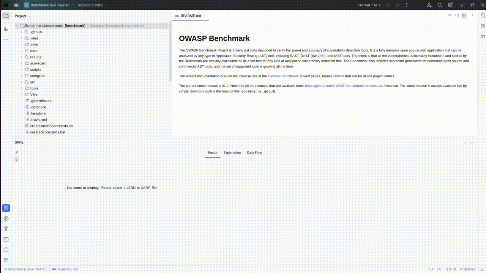

# SAFE - Static Analysis Findings Explainer

SAFE helps developers understand security findings flagged by Static Application Security Testing (SAST) tools. It supports Static Analysis Results Interchange Format (SARIF) results and uses large language models (LLMs) to explain root causes, potential impacts, and practical mitigations for software vulnerabilities.

## SAFE Plugin Features

- **SARIF support**
  - Import SAST results in SARIF to view findings directly in IntelliJ IDEA plugin tool window. 
- **LLM-powered explanations**
  - For each finding, SAFE displays: vulnerability name, SAST tags, an explanation of the vulnerability, a demonstrative example, and mitigation strategies. 
  - Quick thumbs up/down for feedback on explanation quality. 
- **Audience-aware guidance** 
  - Toggle explanation depth by experience level (beginner, intermediate, advanced). 
- **Data-flow walkthrough**
  - When available from the SAST report, step through the data flow for the selected finding.

## How to Run

Clone the project, import it in IntelliJ IDEA, and run the plugin. After the IDE opens, configure the LLM client under **Settings | Tools | SAFE**: pick a platform (`openai` or `ollama`), enter the endpoint URL, model name, temperature, and API key. The API key is stored in IntelliJ's PasswordSafe; the rest is persisted via the standard settings mechanism, so configuration survives IDE restarts and only needs to be entered once per machine.